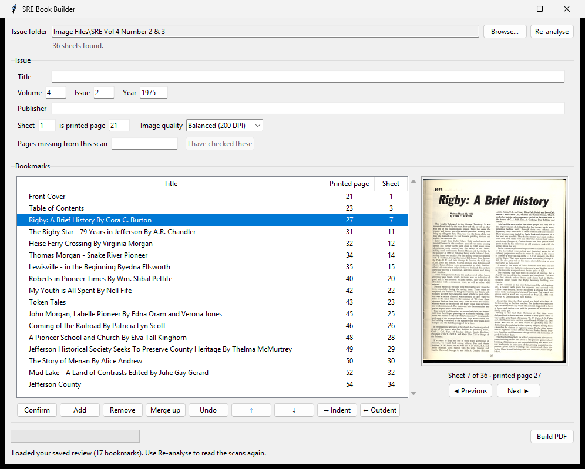
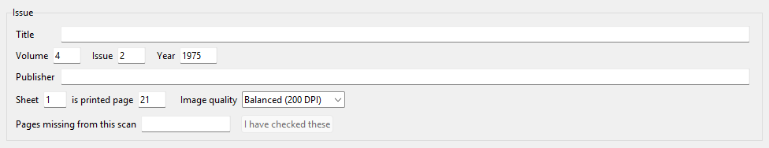
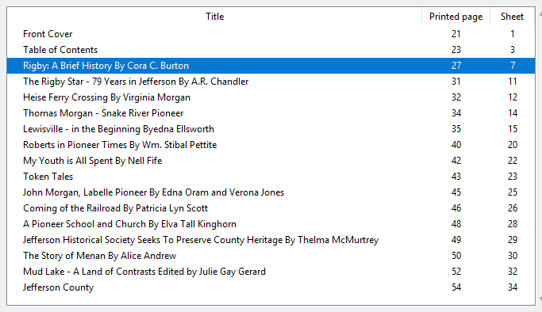
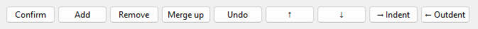

# SRE Book Builder — Operator Guide

Turns a folder of scanned pages into one PDF that can be searched, and that has
a clickable list of articles down the side.

Print this and keep it by the workstation.

---

## Before you start

You need one folder containing the scans for **one issue**, and nothing else.
The files must be TIFFs, one page per file, named so they sort in reading order
— `..._01.tif`, `..._02.tif`, and so on. The first file must be the front cover.

The program never changes your scans. It only reads them.

---

## The window

Everything happens here, top to bottom: choose the folder, check the issue
details, review the bookmarks, build.

---

## Doing an issue

**1. Open the program** — *SRE Book Builder* in the Start menu.

**2. Click Browse** and pick the issue's folder.

Reading the text starts straight away and takes about a minute for a 20-page
issue. You can fill in the issue details while it works.

**3. Check the issue details.**

Correct anything wrong. Two settings are worth a second look:

> **Sheet ⟨1⟩ is printed page ⟨49⟩**
>
> This tells the finished PDF what page numbers to show. The program works it
> out from the numbers printed in the corners of the pages. **Check it against
> the issue in your hand.** See *Sheets and printed pages* below.

> **Pages missing from this scan**
>
> Usually empty. If it lists page numbers, the folder is short of those pages —
> see *If pages are missing from the scan* below. You can correct the list, and
> everything after it renumbers as you type.

**4. Review the bookmarks.** This is the part only a person can do.

Click any bookmark to see that page on the right. Drag the divider between the
list and the page to make the page bigger, or maximise the window.

**To look at every sheet**, use **◀ Previous sheet** and **Next sheet ▶** under
the page. The bookmark list holds *articles*, so a sheet carrying none — a blank
inside the cover, a full-page photograph — appears nowhere in it. Stepping
through is how you confirm the scan is whole. The caption names each one:

> Sheet 5 of 28 · printed page 2
> Sheet 2 of 28 · front matter ii

*Front matter* means the page is in the book but the printer put no number on
it. It is still there, and still becomes a page in the PDF.

**5. Click Build PDF.**

It takes a second or two, because the text was already read in step 2. The PDF
appears in an `output` folder inside the issue's folder.

If you change a bookmark afterwards, just press Build again — it is quick.

---

## Bookmarks in red

Black entries are settled: the program found the article's heading on that page
and is confident. **Red entries want a decision.** There are three kinds, and
they need different things from you.

The status line at the bottom of the window counts them separately — for
example *"2 to keep or remove, 1 needs a page number"* — so you can see at a
glance which kind of work is left.

### "This is printed here, but the contents page never listed it"

The program found a heading printed on a page — a poem, a book list, the board
of directors — that the issue's own contents page does not mention. The page
number is right. The only question is whether it belongs in the outline.

**Keep it** with **Confirm**, or drop it with **Remove**.

### "The contents page named this, but I could not find where it starts"

The contents page lists an article, but the program could not find its heading
in the body — usually because the heading is worded differently, or the page is
a photograph it cannot read. These show a **—** instead of a page number,
because the number it has is only a placeholder.

**Give it a page number**, then confirm it.

These sit **at the bottom of the list**, below everything with a real page,
because the program has no idea where they go. Do not go looking for them in
page order.

### "This one is waiting on a page that was never scanned"

The contents page lists an article starting on a page the folder does not
contain. This is not yours to fix, and the program does not ask you to place it:
there is no page to point it at until someone rescans.

It shows the printed page it is waiting for, and stays in your saved review. It
is left out of the PDF. Scan the page, build again, and it takes its place. See
*If pages are missing from the scan* below.

### The buttons

| Button | What it does |
|---|---|
| **Confirm** | Accepts the selected bookmark as it stands |
| **Add** | A new bookmark on the sheet you are looking at, for something the program missed entirely |
| **Remove** | Deletes the selected bookmark |
| **↑ ↓** | Moves a bookmark up or down the list |
| **Merge up** | Joins the selected bookmark onto the one above it, for an article split into a title and a byline |
| **Undo** | Steps back one change to the list. Ctrl-Z does the same |
| **→ Indent** | Tucks a bookmark under the one above, for poems inside a poetry section |
| **← Outdent** | Brings it back out to the top level |

**The program will not build until the first two kinds are dealt with.** That is
deliberate: a bookmark that jumps to the wrong page is worse than no bookmark,
because a reader has no way to tell. The third kind — waiting on a page that was
never scanned — is not yours to fix and does not hold up a build.

### When one article becomes two bookmarks

Some issues print the article's title on one line and the author's name on the
next, and the program reads them as two separate entries:

> The Rigby Star: 79 Years in Jefferson
> By A.R. Chandler

The same happens when a long heading is broken across two lines. Select the
**second** of the pair and click **Merge up**. The two titles join into one, and
the bookmark keeps the *first* one's page — which is where the article actually
starts, since the second may have been parked elsewhere.

You do not have to retype anything. Merge as many times as it takes, and if you
join the wrong pair, **Undo** puts them back exactly as they were.

### Finding the right page

Use the issue's own contents page. It gives a **printed page number** — the
number printed on the paper. Type that straight into the **Printed page**
column and the program works out which scan it is.

> Contents page says the article is on page **56**.
> Double-click the **Printed page** cell and type **56**.
> The Sheet column fills itself in.

You never need to do that arithmetic yourself. If you type a page the issue does
not have, it will say so rather than accept it.

Then click the bookmark and check the picture on the right really does show that
article starting. That check takes two seconds and is the whole point of the
preview.

---

## Sheets and printed pages

These are different, and the difference matters.

- **Sheet** — which scan it is. Sheet 1 is the first file, always.
- **Printed page** — the number printed on the paper in 1971.

They are often not the same. *Snake River Echoes* was paginated continuously
through each volume, so an issue can start at printed page 27, or 49, or 73. The
cover and contents pages usually carry no printed number, but they are still
counted.

If sheet 1 is printed page 49, the finished PDF shows `49 (1 of 24)` — so a
citation to page 56 takes a reader to page 56.

### When the numbering starts after the cover

In many issues the cover and the contents page carry no printed number at all,
and printed page 1 is the third sheet. Say so with the same setting:

> **Sheet ⟨3⟩ is printed page ⟨1⟩**

The two sheets before it are then numbered **i** and **ii**, the way a book
numbers its front matter, and the Printed page column shows those roman numerals
so you can see it worked. You can type `ii` back into that column just as you
would type `14`.

Do not try to give the cover a printed page of **0**. There is no page 0, and the
program will refuse it. Front matter is what that setting is for.

> **If every bookmark suddenly points past the end of the issue**, you have
> almost certainly typed printed page numbers into the **Sheet** column. Use the
> **Printed page** column instead. The program will usually spot this and say so.

---

## If pages are missing from the scan

Sometimes the program will warn you, right after it reads an issue:

> The contents page refers to printed page(s) 28, 29, which no scan in this
> folder carries.

It works this out two ways. It reads the numbers printed on the pages
themselves — if one scan prints 27 and the very next prints 30, then 28 and 29
are not in the folder. And it compares the contents page's own citations against
the pages it can see, which catches pages missing off the end of an issue, where
there is no later number to show the jump.

**This is worth stopping for.** Check the issue against the paper copy.

It is not a guess about your work. Of the first five issues run through this
program, three turned out to be missing pages that nobody had noticed.

### What the program does about it

**The numbering steps over the gap.** If sheet 3 is page 27 and sheet 4 is page
30, that is what the finished PDF says. The pages keep the numbers printed on
them; nothing is renumbered to close the hole.

**The article on the missing page keeps its bookmark.** It sits in the list
marked as waiting on a page that is not in this scan, showing the page number it
belongs on. It is **not** written into the PDF — a bookmark that jumps to the
wrong page is worse than none, because a reader cannot tell. It stays in your
saved review, so when the pages are scanned and you build again, it comes back
in the right place on its own.

**You have the last word on the list.** The **Pages missing from this scan**
box in the issue panel is yours to edit. The program is reading OCR of a page
printed in 1971 and can misread a number, so if it has this wrong, correct it —
everything after renumbers as you type.

**It will not build until you answer.** Either correct the list, or click
**I have checked these**. That is deliberate: publishing a book that is quietly
short of two pages is the thing this whole check exists to prevent.

### Getting the missing pages in later

Scan the pages that were missed, put them in the folder in reading order, and
open the issue again. Click **Re-analyse** so the program reads the new scans,
check the page numbers, and build. The bookmark that was waiting takes its
place.

---

## The other settings

**Image quality** — leave on *Balanced (200 DPI)* unless you have a reason.
*High* makes a much larger file; *Small* is for emailing. Changing it does not
mean re-reading the text, so it is cheap to try.

**Colour** is not a setting. The finished PDF keeps whatever the scanner
captured: a colour scan stays in colour, a black-and-white one stays black and
white. Colour costs about 7% in file size.

> Versions before 0.1.8 converted everything to black and white. If you built
> an issue with colour covers or photographs on an older version, build it
> again — the bookmarks you reviewed are saved, so it takes about a second.

**Re-analyse** — reads the scans again and throws away the bookmarks currently
listed, including any you edited. Use it if you open an issue that was done some
time ago and the list looks wrong or empty. It asks before discarding anything.

---

## What you end up with

Inside the issue folder, an `output` folder containing:

| File | What it is |
|---|---|
| `..._Vol1_No3.pdf` | **The finished book.** This is the one to keep and share |
| `..._Vol1_No3.srebook.json` | Your review, saved. Keeps the PDF rebuildable later |
| `.cache` | Working files. Large, and safe to delete |

The PDF opens showing the bookmark list. Readers can search it with Ctrl-F.

---

## If something goes wrong

**"There are no page scans (.tif) in ..."**
The folder has no TIFFs, or you picked the folder above the right one.

**"Could not read the scan ._SOMETHING.TIF"**
You are on a version before 0.1.4. Those "._" files are left behind by Macs
writing to a shared drive; they are not scans. Update, and they are ignored.

**"... holds 24 pages in one file."**
The scans are one big TIFF rather than one file per page. Split it and try
again — the program needs a file per page so it can bookmark and number them.

**An article from the contents page cannot be found anywhere.**
Check whether its page is in the scan at all. A missing page is the commonest
reason, and the program warns about it when it can tell.

**The bookmark list is nearly empty.**
Some issues set their contents page in a way the program reads poorly. Add the
bookmarks by hand with **Add**, using the contents page. The PDF is still fully
searchable either way.

**The cover and contents page are being given printed numbers, and should not be.**
Set **Sheet ⟨3⟩ is printed page ⟨1⟩** — or whichever sheet is really printed
page 1. See *When the numbering starts after the cover* above.

**The list looks like an old, worse result.**
Opening an issue shows the review you saved last time. Click **Re-analyse** to
read the scans afresh.

**A page looks crooked or blank in the preview.**
Check the original scan. The program straightens pages automatically but cannot
fix a bad scan. A page it cannot read is still included — it just has no
searchable text on it.

**It refuses to build and lists problems.**
Each line names one bookmark and what it needs. Deal with them and press Build
again.

---

## What this program will not do

It does not check whether the bookmark titles are *correct* — only that each one
points at a real page. If the contents page has a typo, so will the bookmark,
unless you fix it.

**You are the accuracy check.** The program is a head start, not an authority.
